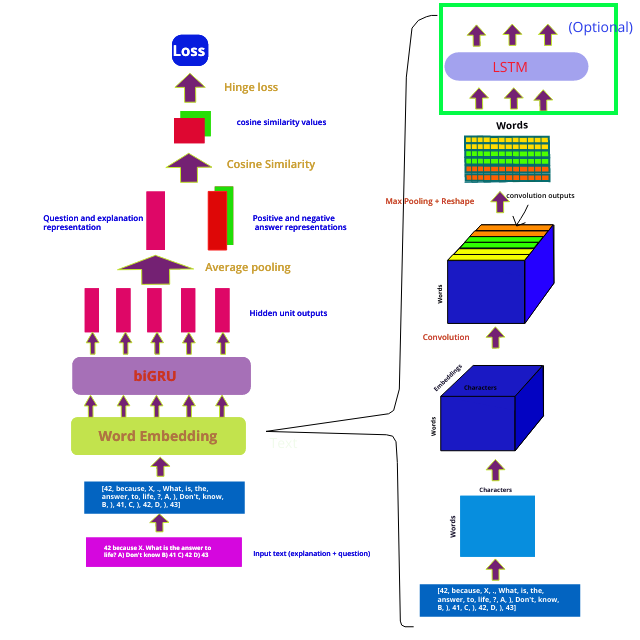

# **Deep QA with the World Tree Explanation Corpus**
### Introduction
In this project we use deep learning to predict answers to multiple choice science questions for which explanations are provided. Explanations are generated by taking sentences expressing systematic relationships between objects from a knowledge base e.g. a star is a kind of celestial object and celestial body. These questions and explanations are found in the [world tree explanation corpus dataset](https://arxiv.org/abs/1802.03052) made available by Peter Jansen (2018).

Two example questions and explanations:

Question|Explanation|Ans
---|---|---
The Sun appears to move across the sky each day, rising in the east and setting in the west. What causes this apparent motion? (A) the rotation of Earth on its axis (B) the revolution of the Sun around Earth (C) the Earth's distance from the Sun (D) the properties of Earth's atmosphere| the Earth rotating on its axis causes the sun to appear to move across the sky during the day. the sun rises in the east. the sun sets in the west. rising is a kind of motion. setting is a kind of motion. if a human is on a rotating planet then other celestial bodies will appear to move from that human 's perspective. Earth is a kind of planet. the Sun is a kind of star. a star is a kind of celestial object and celestial body. the Earth rotates on its axis on its axis.|A
Which of the following represents a chemical reaction? (A) a sugar cube dissolving in water. (B) ice cubes forming in a freezer. (C) ice cream melting in a bowl. (D) a cake baking in an oven.|cooking causes a chemical reaction. baking is similar to cooking. chemical reactions cause chemical change.|D

### Relevant literature

#### Ming Tan et al. (2016)
We draw heavily from the paper **"LSTM-based Deep learning Models for Non-factoid answer selection"** by Ming Tan and others. This paper deals with QA for insurance, where the system is supposed to pick an answer from a database of answers to answer queries about insurance. Because insurance questions are about a range of different topics, different answers address different topics, e.g. life/savings insurance, and are not appropriate for questions of another topic. The approach then is to generate representations for the topic for both questions and answers. Questions and answers about the same topic would have similar representations while questions and answers about dissimilar topics would have dissimilar representations.

We adapt this approach and treat questions and explanations as a single entity i.e. we concatenate the question and explanation and treat the resulting vector as the question.

We adopt two model modifications from the paper:  
- The paper proposes that using average pooling of RNN hidden unit output (in keras this involves setting return_sequences to True in the RNN settings) works better than using just the RNN final state output.  

- As an extension, the paper proposes using convolution over average pooling over the hidden unit outputs. They show that in fact convolution works better than average pooling.

The paper also proposes a third modification using attention, but we did not try this.

One problem with using the approach from this paper is that answers are much shorter than the combined question and explanation (or even question/explanation separately) in our dataset. In the insurance QA task, questions and answers are of comparable length. In the science QA, questions and answers are not of comparable length, answers are much shorter than questions/explanations, answers are sometimes/most of the time just one or two words. Nevertheless deep learning is powerful and we apply this approach with reasonable success.

  

   

  

#### Yoon Kim et al. (2015)

We also try character embedding according to the paper **"Character-Aware Neural Language Models"** by Yoon Kim and others. In this paper the authors propose doing word embedding by looking at the characters of each word. A word is a string of characters. This string of characters can be converted into corresponding character embeddings (learnable), convolution and max pooling is then applied over the 2d array to obtain a 1d vector that works as an embedding for that word.

We find less success with using character embeddings on our task, although this might be because we have not tuned the model sufficiently.

### Models
Below we show the training architecture for the different models.

During training we sample from one wrong answer from the three wrong answers and calculate a hinge loss that is smaller when the cosine similarity with correct answer is larger and/or the cosine similarity with the wrong answer is smaller. We fit for a fixed number of iterations (typically 5), then sample another answer from the three wrong answer options at random.

During testing, we calculate answer representations for each of the four answer options and pick as the answer the answer option with the highest similarity to the question representation.

 Prediction models are similar, except during prediction, we calculate representations for each of the four answer options and pick as answer the option with the greatest similarity to the question/explanation.

 Question/explanations and answers are fed to the same network i.e. there isn't separate rnns/separate weights for question and answers
#### 1) Baseline (plain biGRU)
**Main feature: Take final state from biGRU**
#### 2) avg pooling

  

**Main feature: Average pooling after RNN**

#### 3) max pooling

**Main feature: Max pooling after RNN**
#### 4) CNN

**Main feature: cnn applied to RNN output**

#### 5) character embedding

**Main feature: use characters in word to infer word embedding**

### Results

#### Summary
We readily achieve about 70% accuracy without much hyperparameter tuning and 75 - 80% accuracy with some hyperparameter tuning. We find that the additional convolution operation over the RNN output helps - accuracy for the cnn model is about 5% higher than that for the vanilla rnn model with average pooling (for the same hyperparameters).  

Results on standard model and parameters:

model| no. of parameters| val loss|val acc|test acc
---|---|---|---|---
baseline|38k|0.395|43%|35%
max pool|38k|0.226|67%|72%
avg pool|38k|0.238|63%|63%
cnn|50k|0.212|68%|68%
char(cnn)|101k**|0.362|46%|43%
char(cnn_lstm)|14k***|0.449|38%|23%
**Best model^**|**50k**|**0.084^^**|**75%**|**79%**

^ Best model is standard cnn model with hinge loss threshold =  0.25.   
^^ part of the reduction of the val loss is due to the lower threshold, since loss and hinge loss is directly related with the threshold of the hinge loss function. i.e. initially val loss is around 0.25 instead of 0.5  
\*\*  filter channels =  [25,50,75,100,125,150]  
\*** filter channels = [10,10,10,10,10,10]

**Best model loss:**  

#### standard parameters and hyperparameters

Train test split:

train|val|test|Total
---|---|---|---
1363|150|150|**1663**

hyperparameter| value
---|---
units|20
hinge loss threshold| 0.5
regularization| 0
dropout rate|0.5
recurrent dropout rate| 0
filter channels (cnn only)| 10 for each window size
**training parameter**| **value**
optimizer| adam
learning rate| 0.001
decay| 1e-4
iterations| 100
epochs per iteration| 5
batch size| 64

### extensions/ideas:
- instead of negative sampling every iteration, maybe change model to calculate the hinge loss for each of the three wrong answers, then minimize the sum of the three hinge loss. This might reduce randomness and help make training faster.
- try adding batch normalization - "batch normalization makes training less sensitive to hyperparameter settings" - Andrew Ng
- try regularization..

### Main code files
- Deep_qa.py contains the main object class that packages all methods for running training and predictions etc.. Deep_qa delegate logic to _deepqa_main.py and _deepqa_misc.py to reduce clutter, so that main file is more lean and easy to read.   

          model = Deep_qa()  
          model.load_data('word')  
          model.load_model(models.model, units = 10, model_flag = 'cnn', threshold = 0.5)  
          model.train(num_iter = 50,fits_per_iteration = 5,
                 verbose = 1,
                 batch_size = 64,
                 learning_rate = 0.01,
                 decay = 1e-4,)
          cache = model.predict()
- Data and Data_char are classes that condense/package all the preprocessing of the raw data files  

      data = Data()  
      data.preprocess()
-  models.py and models_char.py contains functions for defining the keras models used in this project
- callbacks.py contain some callback functions used for checking loss, accuracy and other things that keras does not usually print
- Char_embedding_layer contains the cnn and cnn-lstm character embedding layers used in the character embedding parts of the project
- loss_functions.py contain functions such as cosine similarity or hinge loss

### Dataset
Unprocessed dataset can be downloaded at http://cognitiveai.org/explanationbank/

The version used in this project is the "with mercury" dataset, i.e. Worldtree_Explanation_Corpus_V1_Sept2017_withMercury.zip

The noMercury dataset contains the same questions, but for a large portion of the questions, the question text is censored i.e. replaced with the following text: "Text of licensed questions can be requested at: http://data.allenai.org/ai2-science-questions-mercury"

Also, note that although the last index of the questions is 2200, some indexes are skipped, and after processing the file contains 1663 questions.

### Technical notes

#### 1) loading Word embeddings

To make word embeddings load quickly, the word embedding file is split into the word and the numerical embeddings and loaded separately. Normally it takes at 3 minutes+ to load the largest Glove embeddings (840B,300D), with this method it takes less than 20s to load.

See https://www.quora.com/What-is-a-fast-efficient-way-to-load-word-embeddings-At-present-a-crude-custom-function-takes-about-3-minutes-to-load-the-largest-GloVe-embedding for details.

Glove embeddings can be downloaded at https://nlp.stanford.edu/projects/glove/

We use the largest Glove embeddings in my models (i.e. glove.840B.300d.zip).

### Other resources:
Peter Jansen: What's in an Explanation? Toward Explanation-centered Inference for Science Exams  
https://www.youtube.com/watch?v=EneqL2sr6cQ

4th place submission for Allen AI Reasoning Challenge (*same* - maybe not exactly the same questions but same type - MCQs without explanations). Used a deep learning approach that is very similar to ours, very similar architecture, but they trained with quizlet, flashcard.com question and answer pairs as they did without explanations provided in the world tree corpus dataset. Achieved 56% accuracy  
https://github.com/tambetm/allenAI
